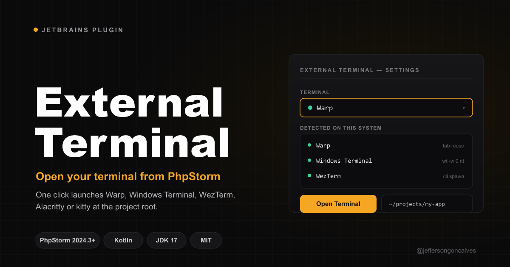

# External Terminal Launcher



[](https://plugins.jetbrains.com/plugin/32357-external-terminal-launcher)
[](https://plugins.jetbrains.com/plugin/32357-external-terminal-launcher)
[](https://github.com/jeffersongoncalves/external-terminal-plugin/actions/workflows/build.yml)
[](https://github.com/jeffersongoncalves/external-terminal-plugin/releases)
[](LICENSE)

A JetBrains IDE plugin (PhpStorm and other IntelliJ-based IDEs) that opens an **external
terminal emulator** at your project's root directory — from a top-toolbar button or a Tools
menu action. Terminal-agnostic by design, starting with [Warp](https://www.warp.dev).

## Install

Install from the [JetBrains Marketplace](https://plugins.jetbrains.com/plugin/32357-external-terminal-launcher)
— in the IDE: **Settings → Plugins → Marketplace**, search for *External Terminal Launcher*.

## Supported terminals

| Terminal          | Windows | macOS | Linux | Tab reuse |
|-------------------|:-------:|:-----:|:-----:|-----------|
| Warp              |   ✅    |  ✅   |  ✅   | automatic (when already running) |
| Windows Terminal  |   ✅    |   —   |   —   | `wt -w 0 nt` |
| WezTerm           |   ✅    |  ✅   |  ✅   | `wezterm cli spawn` |
| Alacritty         |   ✅    |  ✅   |  ✅   | not supported (no tabs) |
| kitty             |    —    |  ✅   |  ✅   | remote control (`kitty @ launch`) |

## Usage

1. **Settings → Tools → External Terminal**
2. Pick your terminal, toggle **Reuse existing window as a new tab**, and optionally set a
   custom executable path.
3. Click the terminal button in the top toolbar (or **Tools → Open External Terminal**).

The terminal dropdown only lists emulators detected on the current system (plus your saved
choice). Set a custom executable path to surface a terminal installed in a non-standard
location.

No keyboard shortcut is bound by default — assign one under **Settings → Keymap** by
searching for *Open External Terminal*.

## How it works

Each terminal is a `TerminalProvider` that, given the OS, an optional executable override,
the project directory and the reuse-tab preference, produces a pure `LaunchSpec`
(executable + args). `TerminalLauncher` resolves the configured provider, checks the binary
is installed, and spawns it with `GeneralCommandLine`. Command construction is fully
unit-tested per terminal and per OS.

### A note on Warp

On macOS/Linux Warp's `warp://` URI scheme cannot carry a working directory, so the plugin
invokes the binary with the directory as a positional argument instead. On Windows the binary
parses its first argument as a URI — a bare path like `C:\foo` is rejected — so there the
plugin passes Warp's documented `warp://action/new_tab?path=` deep link. When Warp is already
running it reuses the existing window as a new tab on its own — there is no explicit flag for it.

## Development

```bash
./gradlew runIde          # launch a sandbox IDE with the plugin
./gradlew test            # run unit tests
./gradlew buildPlugin     # produce build/distributions/*.zip
```

- Kotlin + IntelliJ Platform Gradle Plugin 2.6.0
- Target: PhpStorm 2024.3 (`since 243`, `until 263.*`), JDK 17

## Adding a new terminal

1. Implement `TerminalProvider` in `terminal/` (return `null` from `launchSpec` for
   unsupported OSes).
2. Register it in `TerminalRegistry.providers`.
3. Add provider tests to `TerminalProviderTest`.

## License

See [LICENSE](LICENSE).
